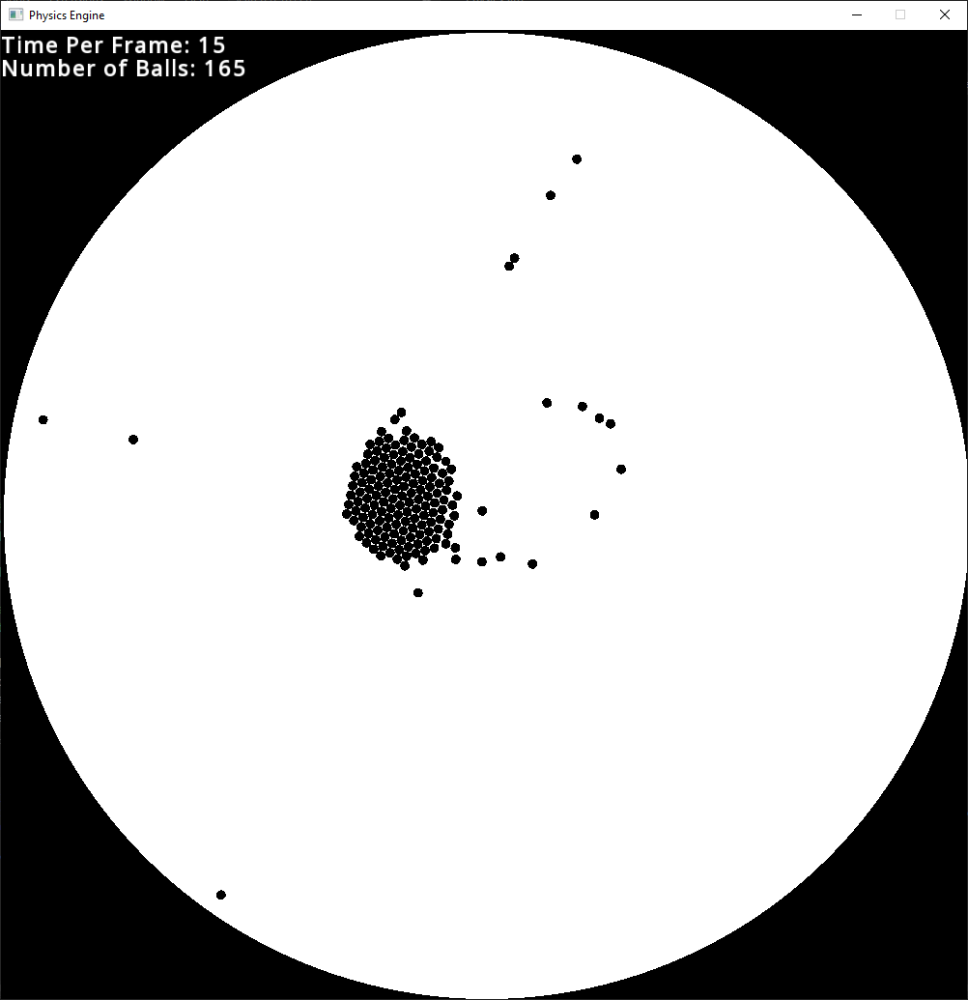

# Physics Simulation

This is a physics simulation written in C++ using the SFML library.
It was my first project in c++ and it helped me to better understand how the language works.

## Examples

## Credit
- https://github.com/johnBuffer for the inspiration and the collision detection code.
-  &  for help with debugging the physics implementation.
